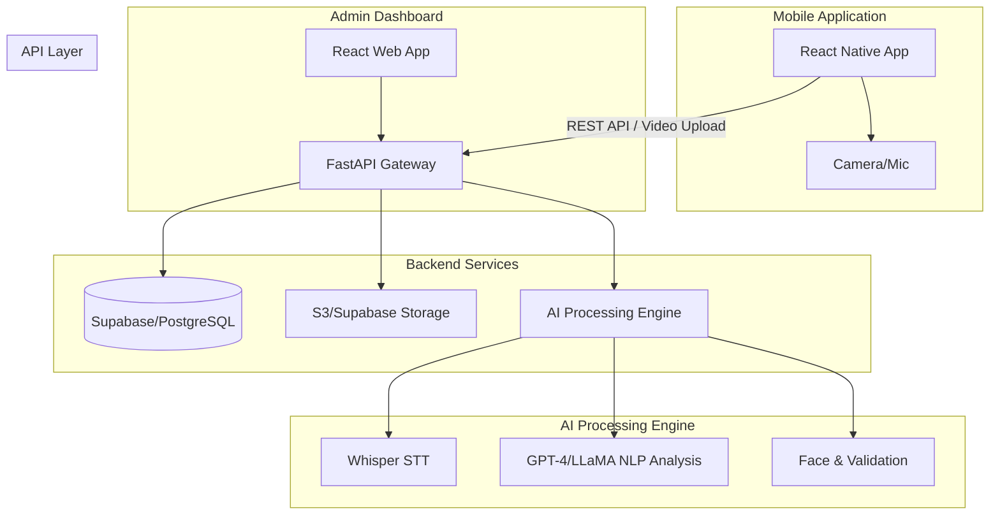

# AI SkillFit System Architecture

## Overview
AI SkillFit is a mobile-first platform designed to conduct AI-led video interviews for blue-collar and polytechnic-skilled workers. It processes candidate responses through voice and text analysis to determine job fitment, detect fraud, and provide an admin dashboard for reviewers.

## Architecture Diagram

## Data Flow
1. **Registration**: Candidate selects language and enters details. Saved to Supabase DB.
2. **Interview Session**: System prompts candidate with pre-defined questions.
3. **Response Recording**: App records video + audio of the response and uploads to Supabase Storage.
4. **Processing**:
   - Backend downloads the video.
   - Extracts audio and sends to Whisper for Speech-to-Text (handles Kannada, Hindi, English).
   - Video frames are analyzed via OpenCV for face presence and duplicate checks.
   - Transcript is sent to LLM to extract skills, experience, and confidence.
5. **Scoring**: Backend aggregates scores (relevance, confidence, fraud risk) and classifies candidate (Job Ready, Needs Training, etc.).
6. **Dashboard**: Admins can view complete profiles, video playback, and AI scores in real-time.

## Tech Stack
- **Mobile UI**: React Native (Expo)
- **Admin UI**: React.js, Tailwind CSS
- **Backend API**: FastAPI (Python)
- **Database & Storage**: Supabase (PostgreSQL + S3 compatible storage)
- **AI/ML**: OpenAI Whisper (Speech-to-Text), OpenAI GPT-4o (NLP/Analysis), OpenCV (Face detection)

## Deployment Steps
1. **Supabase Setup**:
   - Create a new project on Supabase.
   - Run the provided SQL script to create tables (`candidates`, `interviews`).
   - Create a Storage Bucket named `videos`.
2. **Backend**:
   - `cd backend`
   - `pip install -r requirements.txt`
   - Set `.env` with `SUPABASE_URL`, `SUPABASE_KEY`, `OPENAI_API_KEY`.
   - Run: `uvicorn app.main:app --reload`
3. **Mobile App**:
   - `cd frontend-mobile`
   - `npm install`
   - Update `API_URL` to point to backend.
   - Run: `npx expo start`
4. **Admin Dashboard**:
   - `cd frontend-admin`
   - `npm install`
   - Update `API_URL` to point to backend.
   - Run: `npm run dev`
